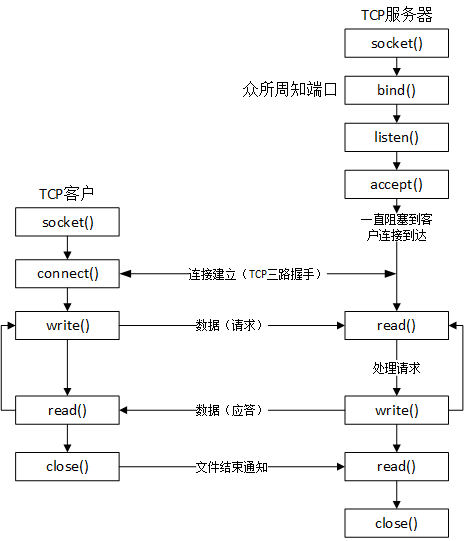

<h1 id=file_notes>
    第04章 基本TCP套接字编程
</h1>

[本章函数表](func.md "包含本章所介绍函数的详细说明")
[章节目录](../volume1.md "章节目录")

---

本章讲解编写一个完整的TCP客户/服务器程序所需要的<b>基本</b>套接字函数。


<h2 id=func_socket title="socket函数">
	总图
</h2>

<div style="text-align:center">
	
	<p>基本TCP客户服务器程序的套接字函数</p>
</div>


<h2 id=func_socket title="创建一个套接字描述符，并指定协议族和套接字类型">
	socket函数
</h2>

创建一个套接字描述符，并指定协议族和套接字类型。

[详细说明见此。](func.md#func_socket)

##### AF_XXX 和 PF_XXX
AF_前缀表示地址族，PF_前缀表示协议族。尽量使用AF，而不是PF。

<h2 id=func_connect title="TCP客户用connect函数来建立与TCP服务器的连接">
	connect函数
</h2>

TCP客户用connect函数来建立与TCP服务器的连接。

[详细说明见此。](func.md#func_connect)

<h2 id=func_bind title="把一个 本地 协议地址赋予一个套接字">
	bind函数
</h2>

把一个 本地 协议地址赋予一个套接字。

[详细说明见此。](func.md#func_bind)

<h2 id=func_listen title="把一个未连接的套接字转换成一个被动套接字，指示内核应接受指向该套接字的连接请求">
	listen函数
</h2>

把一个未连接的套接字转换成一个被动套接字，指示内核应接受指向该套接字的连接请求。

[详细说明见此。](func.md#func_listen)

<h2 id=func_accept title="从已完成连接队列队头返回下一个已完成连接">
	accept函数
</h2>

从已完成连接队列队头返回下一个已完成连接。

[详细说明见此。](func.md#func_accept)

<h2 id="func_fork_exec">
	fork和exec函数
</h2>

参考《UNIX环境高级编程》，此处略。

<h2 id=func_close title="关闭套接字并终止TCP连接">
	close 函数
</h2>

关闭套接字并终止TCP连接。

[详细说明见此。](func.md#func_close)

<h2 id=concurrent_server>并发服务器</h2>

迭代服务器：接受一个客户的请求并完成请求后，才接受下一次请求。即服务器被单个客户完全占有。

并发服务器：可以同时响应多个客户的请求。典型的程序轮廓如下。
```c
pid_t pid;
int listenfd, connfd;

listenfd = socket(...);
bind(listenfd, ...); /* 在 sockaddr_in{} 中填充服务器的端口 */

while(1)
{
	connfd = accept(listenfd, ...); /* 可能被阻塞 */

	if ((pid=fork()) = 0)
	{
		/* child */
		close(listenfd); /* 子进程关闭监听套接字 */
		doit(connfd);    /* 响应请求 */
		close(connfd);   /* 关闭 TCP 连接 */
		exit(0);         /* 子进程退出 */
	}
	/* fork后，connfd 的引用计数变为2。*/
	/* 父进程关闭后，引用计数变为1，并不会导致 TCP 连接断开 */
	close(connfd);       /* 父进程关闭已连接套接字 */
}
```

<h2 id=func_getsockname title="返回与套接字相关的 本地 协议地址">
	getsockname 函数
</h2>

返回与套接字相关的 本地 协议地址。

[详细说明见此。](func.md#func_getsockname)

<h2 id=func_getpeername title="返回与套接字相关的 外地 协议地址">
	getpeername 函数
</h2>

返回与套接字相关的 外地 协议地址。

[详细说明见此。](func.md#func_getpeername)

---

[本章函数表](func.md "包含本章所介绍函数的详细说明")
[章节目录](../volume1.md "章节目录")