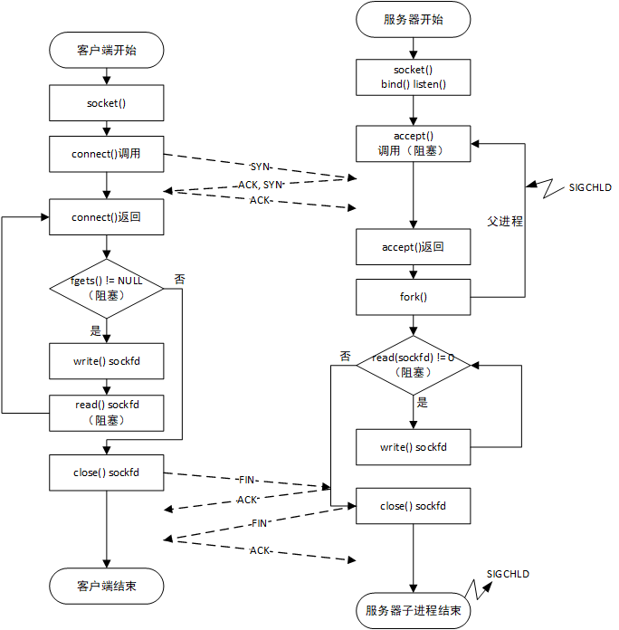

<h1 id=file_notes>
    第05章 TCP 客户/服务器程序示例
</h1>

[章节目录](../volume1.md "返回章节目录")

---

<h2 id=tcp_echo_serv>
    TCP回射服务器程序
</h2>

main()函数

```c
int main(int agrc, char **argv)
{
    int       listenfd, connfd,
    pid_t     childpid;
    socklen_t clilen;
    struct sockaddr_in cliaddr, servaddr;

    listenfd = Socket(AF_INET, SOCK_STREAM, 0); // 创建一个TCP套接字

    bzero(&servaddr, sizeof(servaddr));
    servaddr.sin_family = AF_INET;
    servaddr.sin_addr.s_addr = htonl(INADDR_ANY);
    servaddr.sin_port = htons(SERV_PORT);

    Bind(listenfd, LISTENQ);  // 绑定本地协议地址

    Listen(listenfd, LISTENQ); // 转换成监听套接字

    while(1) {
        clilen = sizeof(cliaddr);
        connfd = Accept(listenfd, (SA*)&cliaddr, &clilen); // 等待客户连接完成

        if ( (childpid = Fork()) == 0) // 派生一个子进程响应客户的请求
        {
            Close(listenfd);
            str_echo(connfd);
            exit(0);
        }
        Close(connfd);
    }
}
```

str_echo()函数
```c
str_echo()函数
```

<h2 id=tcp_echo_serv>
    TCP回射客户程序
</h2>

main()函数

```c
注释写上程序说明
```

str_cli()函数

```c
...
```

<h2 id=normal_startup>
    正常启动与正常终止
</h2>

见下图




<h2 id=normal_startup>
    该代码的问题
</h2>

<h3>从服务器角度</h3>

1、没有处理 `SIGCHLD` 信号
```c
POSIX信号语义总结：
(1) 一旦安装了信号处理函数，便一直安装着。
(2) 信号处理函数运行期间，正被递交的信号是阻塞的。sa_mask指定的信号集也是阻塞的。
(3) 如果信号在被阻塞期间产生了一次或多次，那么该信号解除阻塞后，通常只提交一次。
(4) 可以利用 sigprocmask 选择性的阻塞或解阻塞一组信号，保护代码的执行。

子进程终止后，父进程会收到 SIGCHLD 信号，默认的动作是忽略。
如果没有捕获此信号，子进程会变成僵尸进程。过多的僵尸进程会占用系统资源。

信号处理函数示例：
void sig_chld(int signo)
{
    pid_t pid;
    int   stat;
    while ( (pid = waitpid(-1, &stat, WNOHANG)) > 0)
        printf("child %d terminated\n", pid);
    return 0;
}
说明：
在一个循环内调用 waitpid，以获取所有已终止子进程的状态。
必须指定WNOHANG选项，有尚未终止的子进程在运行时不要阻塞。
第一个参数 -1 表示等待第一个终止的子进程。

如果有多个子进程在差不多的时候终止，此段代码可以处理所有的子进程。
```

2、中断的系统调用
```c
慢系统调用：可能永远阻塞的系统调用（有可能永远无法返回）。比如accept。

当进程阻塞于慢系统调用时，捕获到一个信号并且信号处理函数返回时，
该系统调用 可能 会返回EINTR错误。某些系统自动重启 某些 被中断的系统调用。

为了便于移植，在编写信号处理函数时，必须对系统调用返回 EINTR 有所准备。

示例：
while(1)
{
    clilen = sizeof(cliaddr);
    if ((connfd = accept(listenfd, (SA*)&cliaddr, &clilen)) < 0)
    {
        if (errno == EINTR)
            continue;  /* back to while */
        else
            err_sys("accept error");
    }
}
```

3、accept返回前连接终止
```c
客户的角度：连接建立之后，客户TCP发送了一个RST。
服务器的角度：该连接已由TCP排队，等待服务器进程调用accept的时候RST到达。
             稍后，服务器进程调用accept。
        
处理方法：
源自Berkeley的实现：
    完全在内核中处理终止的连接，服务器进程根本看不到。

SVR4实现：
    返回 EPROTO。

POSIX实现：
    返回 ECONNABORTED。服务器可以忽略，继续调用 accept()。
    某些流子系统中发生致命错误也会返回 EPROTO。
    使用不同的值，服务器进程可以区分，是否还需要调用 accept()。

在16.6节还会讨论此问题。
```

<h3>从客户端角度</h3>

1、服务器进程崩溃

2、服务器主机崩溃

3、服务器主机崩溃后重启

4、服务器主机重启


<h2>数据格式</h2>

1、传递字符串

2、传递二进制数据

---

[章节目录](../volume1.md "返回章节目录")